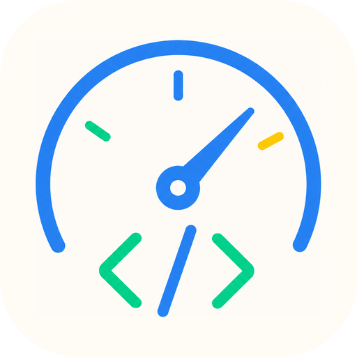

# AgentBench

[](https://github.com/jazzonaut/agentbench/actions/workflows/ci.yml)
[](https://github.com/jazzonaut/agentbench/releases/latest)
[](LICENSE)

**Your coding agent feels slow. AgentBench works out whether it is the machine, and whether it changed.**

A local tool for developer machines running Claude Code. It answers three questions that need three different
kinds of evidence:

- **How fast is this machine right now?** Agent-shaped workloads - small files, SQLite, process launch,
  loopback and disk - run on demand and produce a report you can compare against another machine.
- **Is it slower than last week, and what changed?** A background collector keeps a record: passive system
  samples, a controlled micro-workload every fifteen minutes, and real timings read out of your own Claude
  Code transcripts. It reports today against the days before it, and says when it does not know.
- **What is it doing right now?** A live terminal view of a process tree, for watching an agent work.

Nothing is uploaded. The collector makes one outbound request - a timed HTTPS round trip carrying no prompt
and no credentials - and that request has its own switch. Antivirus, proxy, power and OS settings are never
touched. Startup, `PATH` and the install directory change only when you ask.

## Install

Download the archive for your platform from
[Releases](https://github.com/jazzonaut/agentbench/releases/latest), verify it against `SHA256SUMS`, extract
it, and put `agentbench` (or `agentbench.exe`) on your `PATH`. Windows x64, Linux x64, macOS Intel and macOS
Apple Silicon. Every tagged release carries checksums, generated notes and GitHub build-provenance
attestations.

Or extract it anywhere, run `agentbench`, and let the Install section of the control centre do both for you.

From source, with Rust 1.95 or newer:

```text
git clone https://github.com/jazzonaut/agentbench.git
cd agentbench
cargo install --path .
```

## Start here: run it with no arguments

```text
agentbench
```

One screen, with the answer to *am I actually collecting anything?* at the top and everything you might want
to do underneath. It exists because the alternative was a command line with several dozen flags and a TOML
file. The status band is the same report `agentbench dashboard --status` prints, from the same code, so the
screen and the command cannot disagree about a verdict.

| Section | Rows |
|---|---|
| **Startup** | Run at login, start in the tray, delay after login |
| **Install** | Install a durable copy, add the install directory to `PATH` |
| **Collection** | Sampling cadence, idle cadence, probes on or off, the probe's network request, probe cadence |
| **Sessions** | Read Claude Code transcripts, or do not |
| **History** | How long raw samples are kept, how many days a baseline spans |
| **Server** | Serve the dashboard, and on which loopback port |
| **Actions** | Start collecting, open the dashboard, run a benchmark, run one elevated, compare two reports, erase collected data |

`↑` `↓` move, `space` toggles, `enter` edits a value or runs an action, `r` re-reads everything, `q` quits.

Changes apply as you make them - there is no save key, because every answer to "what happens if you quit
without saving" is a bad one. Rows are disabled with a reason rather than hidden. The one destructive row
asks twice, and refuses outright while a daemon has the database open. Settings are written back to
`watch.toml` with the comments that document it intact.

## The commands

Everything on that screen is also a command, except the two rows about installing the tool. Typing is still
the right answer for scripts, for CI, and for the flags no screen should carry.

| Command | What it does |
|---|---|
| `agentbench bench` | Run the on-demand benchmark and write a JSON report plus a Markdown summary |
| `agentbench dashboard` | Collect continuously and serve the loopback dashboard. `--status` reports on it without starting anything |
| `agentbench compare` | Diff two reports, refusing pairs that cannot mean anything |
| `agentbench top` | Live process-tree view, filtered by name |
| `agentbench profile` | Time one non-interactive command: wall time, first output, CPU, peak RSS, disk bytes, children, exit status |
| `agentbench experiment` | Run a declared set of interleaved cases from a TOML file, with a recorded random seed |

### Comparing two machines

Run the same preset from the repository that feels slow, on both machines, then compare the reports.

```text
agentbench bench --preset standard --target-dir . --output machine-a.json
agentbench bench --preset standard --target-dir . --output machine-b.json
agentbench compare machine-a.json machine-b.json --output comparison.md
```

`compare` refuses mismatched schema versions, run kinds and presets rather than producing deltas that look
meaningful and are not. The comparison names the environment differences it found - OS, CPU, core count,
memory, tool versions, config fingerprints - before it shows a single metric, because that is usually where
the answer is.

### Presets

| Preset | Target duration | Disk ceiling | Generated file | Memory ceiling | Small files |
|---|---:|---:|---:|---:|---:|
| `quick` | 45 s | 128 MiB | 64 MiB | 10% RAM, max 512 MiB | 500 |
| `standard` | 3-4 min | 2 GiB | 512 MiB | 25% RAM, max 2 GiB | 5,000 |
| `stress` | 15 min | 10 GiB | 2 GiB | 50% RAM, max 8 GiB | 20,000 |

`quick` is a sub-minute smoke test. `stress` is explicit and bounded. Workload files land inside
`--target-dir` so the disk numbers describe the volume your code lives on; `--scratch-dir` moves them out of a
watched tree, which matters if an IDE indexer or test watcher would otherwise wake up and compete.

A benchmark includes a live Claude phase by default - interleaved direct and Headroom-proxied cases, `sonnet`,
capped at $5 of reported cost. `--no-live-llm` turns it off; `--offline` skips the public HTTPS timing test
without disabling live calls you asked for. One case gives the model read-only access to everything beneath
`--target-dir`, so run it against a directory you are willing to show a model. See
[measurement.md](docs/measurement.md#live-claude-cases-and-the-one-that-reads-your-files).

## Continuous background collection

`bench` cannot answer "is it slower than on Tuesday", because that needs a record that already existed before
you went looking. The daemon keeps one.

```text
agentbench dashboard          # collect and serve a loopback dashboard
agentbench dashboard --status # check on it without starting anything
```

Turn on "Run at login" in the control centre and you can forget about it. On a first run your existing
transcripts are imported, so the charts open with months of real history instead of being empty.

What it collects:

- **Passive samples**, every few seconds: CPU, memory, swap, process count, security-scanner CPU, and the
  CPU, memory and disk write rate attributed to your agent's process tree.
- **Capability probes**, every fifteen minutes: micro-scale reruns of the same workloads `bench` uses, under
  the same metric names. About a second and a half of work per run, and never a paid API call.
- **The conditions each probe ran in**: the CPU clock as a percentage of nominal, whole-machine disk write
  throughput, free space, the CPU figures behind the contention tag, and the three largest consumers by name.
  This is the difference between "small-file operations dropped at 14:00" and "…and `MsMpEng` was at 180% of a
  core".
- **Real session metrics** from your own transcripts: per-tool latency, response intervals, token accounting,
  and whether a subagent produced the turn.
- **Run markers** around every `bench`, `profile` and `experiment`, so the cliff a three-minute benchmark puts
  in the passive series is labelled rather than read as a machine degrading.

Useful flags: `--port`, `--data-dir`, `--no-serve` to collect without opening a socket, `--sample-interval`
and `--probe-interval` to raise resolution while chasing a regression, `--no-probes`, `--no-probe-network`,
`--no-sessions`, `--sessions-root DIR`.

Probes are **not** skipped when the machine is busy - waiting for an idle moment collects nothing on exactly
the days you care about. Each one is tagged with what it was competing with instead, and the dashboard's
*uncontended probes only* filter is where that tag gets used. What the tag can and cannot see is measured and
written down in [measurement.md](docs/measurement.md#contention-and-why-probes-are-not-skipped).

### Verdicts

Five series earn a verdict. Everything else is charted and none of it is judged, which is a decision rather
than an omission: a verdict on first-response time would report the model's mood as a property of your
machine.

| Series | Why it earns one |
|---|---|
| `probe:filesystem.small_file_ops_s` | Moves when a scanner or filter driver gets into the path |
| `probe:filesystem.sequential_write_mib_s` | Disk throughput at a fixed 8 MiB working set |
| `probe:sqlite.lookup_ms` | Indexed read latency, microseconds on a healthy machine |
| `probe:cpu.single_mops_s` | Thermal throttling and power-plan changes show here first |
| `tool_read_ms` | What your agent actually experienced, from your own transcripts |

The comparison is deliberately coarse: each of the previous seven days is reduced to one value, and the band
is the median and median absolute deviation across those seven numbers. Fewer than four contributing days
produces **no verdict** rather than a confident one. Every verdict discloses the counts behind it, whether the
band hit its 5% floor, and whether the power source moved - and where the conditions themselves moved, a
third line says so: `clean probes: clock 128% today against 136%`. The full method is in
[measurement.md](docs/measurement.md#today-against-the-days-before-it).

### The dashboard

Three pages behind one nav, all served by the same daemon on the same loopback port.

| Page | What it is for |
|---|---|
| `/` | Live tiles, today's activity, the verdicts, and four stacked history frames sharing one cursor |
| `/bench` | Start a benchmark with the options you would otherwise pass as twelve flags, and watch its phases |
| `/compare` | Pick two reports and read the deltas as a page rather than as a generated `.md` file |

The four frames plot the system, the agent, the probes and the conditions each probe ran in - twenty-seven
series between them, each with a caption saying what is part of the reading. Nothing is collected that the
page cannot show, and two tests fail the build if that stops being true.

A benchmark started from the page runs in a **separate process**, which is not an implementation detail: the
daemon samples at background priority and holds the database writer, so a benchmark measured inside it would
report a slower machine than the identical run from a terminal. One at a time; a second request is refused.

Two things the page deliberately will not do. It offers no elevated run - a consent prompt raised by a web
page is one nobody can connect to something they did just now, so that stays in the control centre. And live
Claude cases are **off by default here**, unlike on the command line, because a form whose default spends
money on submission is the wrong default. When you do ask for them, the cost cap is bounded at $20.

```toml
[server]
# Keep the dashboard for reading only. `agentbench bench` is unaffected either way.
allow_runs = false
```

## Storage and privacy

State lives in one directory: `%LOCALAPPDATA%\agentbench\` on Windows, `$XDG_DATA_HOME/agentbench/` on Linux,
`~/Library/Application Support/agentbench/` on macOS. Override it with `--data-dir` or `AGENTBENCH_DATA_DIR`.
It holds `watch.db`, a self-documenting `watch.toml` written on first run, and a lock file that stops two
daemons double-counting the same machine.

**The local database stores real project paths and git branch names**, because a dashboard that cannot tell
you which project was slow is not much use. That is what makes the loopback-only binding load-bearing rather
than a formality, and why writes must additionally prove they came from this dashboard. See
[platform-support.md](docs/platform-support.md#the-dashboard-is-loopback-only-and-checks-the-host-header).

Transcripts are read, never copied. What is stored is timings, token counts, model names, and the project
path and branch a session ran in. No prompts, no code, no command output, nothing from any tool's result.
`--no-sessions`, or `enabled = false` under `[sessions]`, turns the stream off entirely.

Exported reports carry hashed host, path and config fingerprints, so two machines can reveal a mismatch
without exporting its value. Raw config contents, environment values, source paths, prompts and command
arguments are excluded. `--save-command-output` is the one exception: it puts a bounded output tail in the
local JSON, and should not be used with sensitive material.

The database does not grow without limit. After `samples_raw_days` (14 by default) each whole minute of
passive samples is summarised into one row and the raw samples are deleted; charts cross that boundary without
being asked to, and the response says which part of the line is summarised. Probe runs, session metrics and
run markers are not pruned - they arrive slowly and are the whole point of keeping a record, so a year of them
is a few tens of megabytes.

Erasing collected data, from the control centre or by deleting `watch.db`, also removes the import watermarks.
That is deliberate: the next daemon re-reads every transcript from the beginning, so **session history comes
back** while probe and sample history is genuinely gone.

## Starting at login

**On Windows, run `agentbench` and turn on "Run at login".** The control centre registers an unelevated
`ONLOGON` scheduled task, installs a copy of the executable somewhere `cargo clean` will not delete, and can
put that directory on your `PATH`. It never asks for administrator rights. "Start in tray" uses
`agentbench-tray.exe`, which runs with no console window and a notification-area icon whose menu opens the
dashboard, opens the settings screen, or stops collecting cleanly.

The two-minute default delay is not padding: probes that fire during the login storm are recorded as
contended and drop out of the baseline.

For the manual `schtasks`, systemd and launchd recipes, see
[platform-support.md](docs/platform-support.md#starting-at-login).

## Known limits

Each of these is measured rather than assumed, and the numbers behind them are in
[platform-support.md](docs/platform-support.md) and [measurement.md](docs/measurement.md).

- Disk I/O cannot be attributed to another user's processes without privileges this daemon does not take, so
  `scanner_write_bytes_s` is a legitimate flat zero on a machine whose scanner is Defender.
- The CPU clock is a percentage of nominal, not MHz: the MHz figure Windows gives an ordinary process is a
  static registry value.
- A probe's conditions describe roughly the 200 ms before it, so a writer that runs for one second in ten is
  mostly invisible to them.
- `filesystem.sequential_read_mib_s` reports the page cache and `memory.read_gib_s` reports the rate at which
  memory can be *reached*. Both say so in their own descriptions.
- Changing `--probe-interval` partway through a history leaves one chart stretch blank. Affects no judged
  series; the fix is per-neighbourhood gap detection.

## Documentation

| Where | What |
|---|---|
| [`docs/measurement.md`](docs/measurement.md) | What is measured, at what cost, and what each number is worth |
| [`docs/platform-support.md`](docs/platform-support.md) | Per-OS capabilities, the gaps, and autostart recipes |
| [`docs/adr/`](docs/adr/) | Architectural decisions and their rejected alternatives |
| [`branding/README.md`](branding/README.md) | The application icon, and the script that produces every form of it |
| [CHANGELOG.md](CHANGELOG.md) | Release history |
| [CONTRIBUTING.md](CONTRIBUTING.md) | How to propose a change |
| [SECURITY.md](SECURITY.md) | Private vulnerability reporting |

The dashboard embeds [uPlot](https://github.com/leeoniya/uPlot) (MIT), served at `/assets/uplot.LICENSE`. No
asset is fetched from the network, so the page works fully offline.
